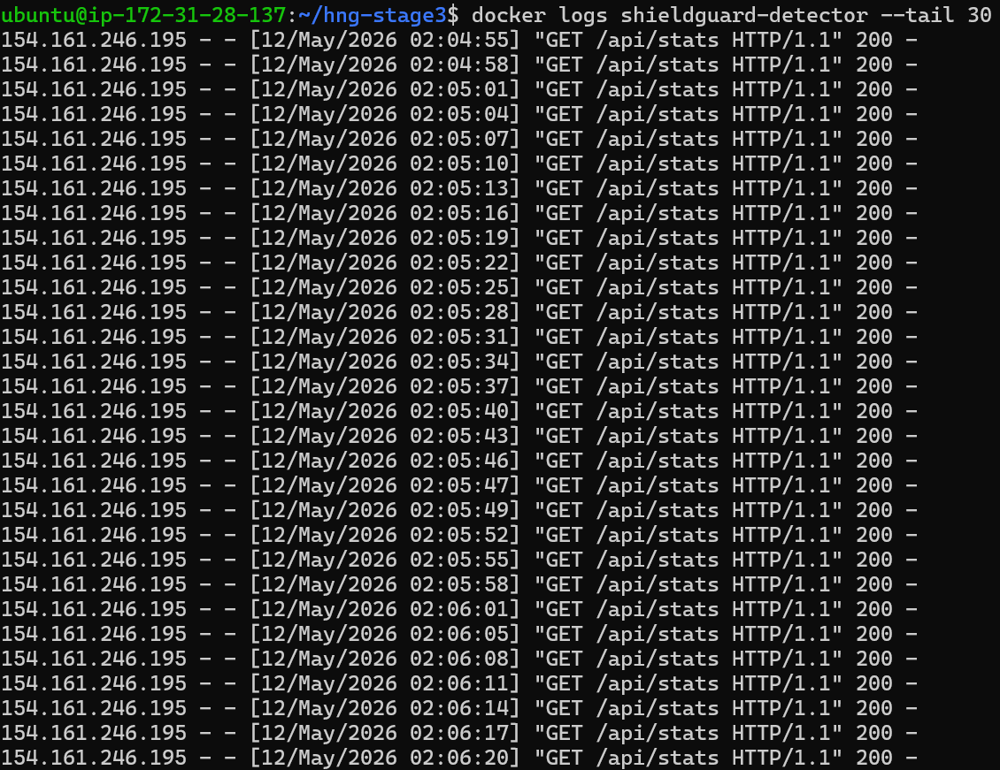
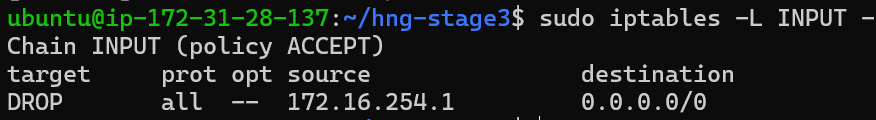
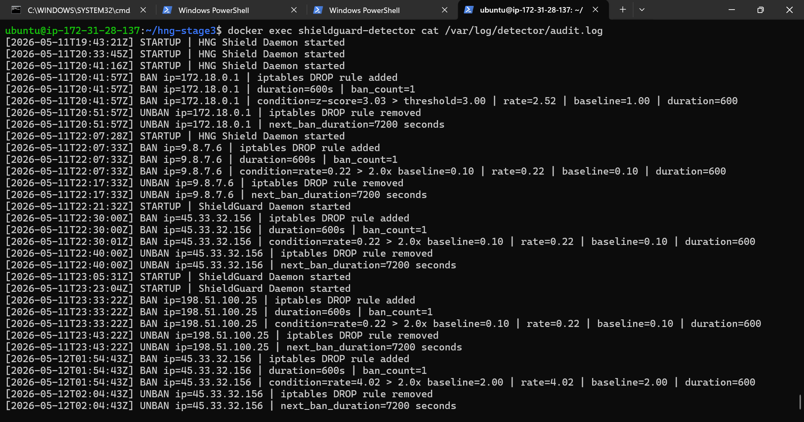
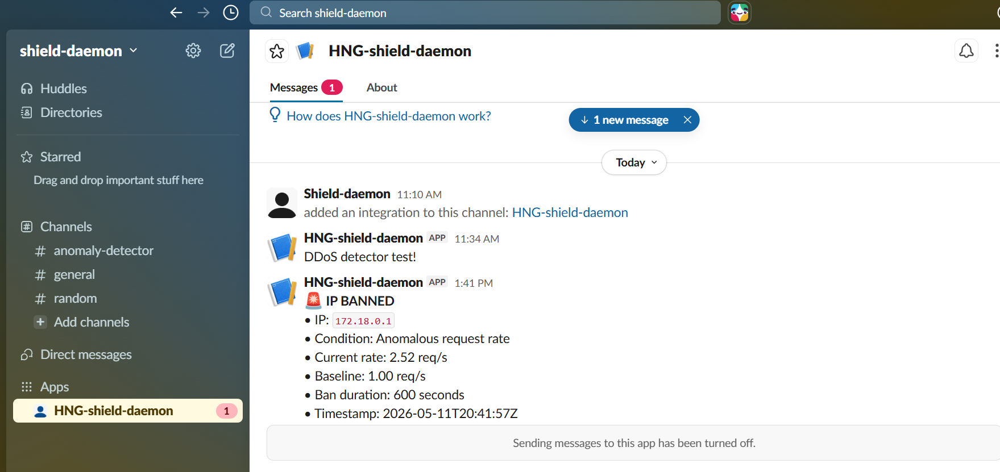
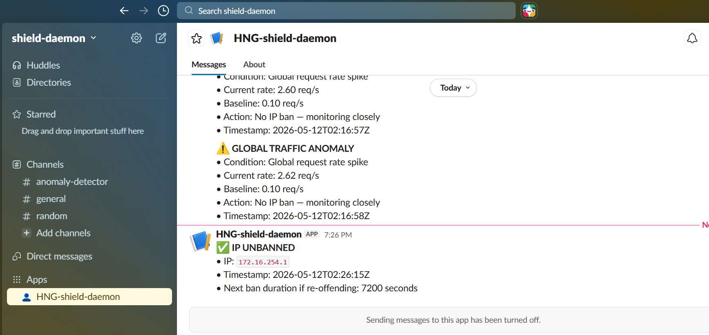
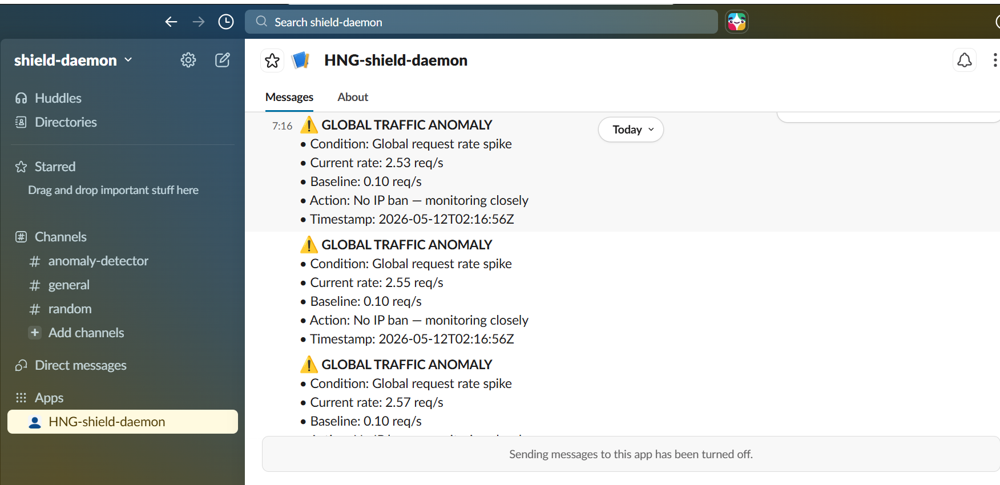

# 🛡️ ShieldDaemon — Real-Time Anomaly Detection Engine


> **A production-grade DDoS and anomaly detection daemon that watches all incoming HTTP traffic in real time, learns what normal looks like, and automatically responds when something deviates — whether from a single aggressive IP or a global traffic spike.**

---

##  Live Demo

| Service | URL |
|---|---|
|  Live Dashboard | http://13.60.224.73:8080 |
|  Protected Nextcloud | http://13.60.224.73 |
|  GitHub Repo | https://github.com/asanteedith/Shield-Daemon-Detection-Engine |

---

##  The Problem

Cloud platforms like Nextcloud are publicly accessible 24/7 — making them prime targets for **DDoS attacks**. A single attacker can flood your server with thousands of requests per second, causing it to crash and become unavailable to real users.

Traditional solutions use **fixed thresholds** — they either block too much legitimate traffic or miss real attacks entirely. They cannot adapt to your actual traffic patterns.

**ShieldDaemon solves this differently:**

- ✅ It **learns** your normal traffic patterns automatically
- ✅ It **adapts** to time-of-day changes using hourly baseline slots
- ✅ It **detects** anomalies statistically using z-scores
- ✅ It **blocks** malicious IPs at the firewall level within 10 seconds
- ✅ It **recovers** automatically with a progressive unban schedule
- ✅ It **alerts** your team via Slack in real time

---

##  Architecture

```
                        ┌─────────────────────────────────────┐
                        │         Linux VM (Single Host)       │
                        │                                      │
  Internet ──HTTP:80──► │  ┌─────────────────────────────┐    │
                        │  │      Nginx (Reverse Proxy)   │    │
                        │  │  JSON access logs → volume   │    │
                        │  └──────────────┬──────────────┘    │
                        │                 │ proxy_pass         │
                        │  ┌──────────────▼──────────────┐    │
                        │  │   Nextcloud (Protected App)  │    │
                        │  └─────────────────────────────┘    │
                        │                                      │
                        │  ┌─────────────────────────────┐    │
                        │  │     ShieldDaemon Detector    │    │
                        │  │  • Tails HNG-nginx-logs vol  │    │
                        │  │  • 60s sliding window        │    │
                        │  │  • 30min rolling baseline    │    │
                        │  │  • Z-score anomaly detection │    │
                        │  │  • iptables IP blocking      │    │
                        │  │  • Slack alerts              │    │
                        │  │  • Live dashboard :8080      │    │
                        │  └─────────────────────────────┘    │
                        └─────────────────────────────────────┘
```

---

##  How It Works

### 1. Log Monitoring
Nginx logs every HTTP request in JSON format to a named Docker volume called `HNG-nginx-logs`. ShieldDaemon tails this file line by line in real time, parsing the source IP, timestamp, method, path, status code, and response size.

### 2. Sliding Window
Request rates are tracked using two `deque`-based windows over the last **60 seconds** — one per IP, one global.

```python
# Every new request is timestamped and appended
self.ip_windows[ip].append(timestamp)

# Old entries beyond 60s are evicted from the left
while self.ip_windows[ip][0] < (now - 60):
    self.ip_windows[ip].popleft()

# Rate = requests in window / window size
rate = len(self.ip_windows[ip]) / 60
```

### 3. Rolling Baseline
Mean and standard deviation are computed from a **30-minute rolling window** of per-second counts, recalculated every 60 seconds. Per-hour slots are maintained so the system adapts to time-of-day traffic patterns.

```python
mean = sum(counts) / len(counts)
std  = sqrt(sum((x - mean)**2 for x in counts) / len(counts))
effective_mean = max(mean, floor_mean)  # prevent zero division
effective_std  = max(std,  floor_std)
```

### 4. Anomaly Detection
An IP is flagged as anomalous if **either** condition fires first:

| Condition | Threshold |
|---|---|
| Z-score | `(rate - mean) / std > 2.0` |
| Rate multiplier | `rate > 2x baseline mean` |

If an IP's 4xx/5xx error rate exceeds 3x the baseline error rate, detection thresholds are **automatically tightened** to catch it sooner.

### 5. Blocking
- **Per-IP anomaly** → `iptables -I INPUT -s <ip> -j DROP` + Slack alert within 10 seconds
- **Global anomaly** → Slack alert only (no single IP to block)

### 6. Auto-Unban Schedule

| Offence | Ban Duration |
|---|---|
| 1st | 10 minutes |
| 2nd | 30 minutes |
| 3rd | 2 hours |
| 4th+ | Permanent |

Slack notification sent on every ban and unban event.

---

## 📊 Live Dashboard

The dashboard at `:8080` refreshes every **3 seconds** and shows:

-  Global request rate (req/s)
-  Baseline mean and standard deviation
-  Banned IPs with ban count and status
-  CPU and memory usage
-  System uptime
-  Top 10 source IPs (60s window)
-  Live traffic rate chart vs baseline

---

##  Screenshots

###  Daemon Running — Processing Live Traffic


###  IP Banned — iptables DROP Rule Active


###  Audit Log — Structured Ban and Unban Events


###  Slack — IP Ban Alert


###  Slack — IP Unban Notification


###  Slack — Global Traffic Anomaly Alert


---

##  Repository Structure

```
Shield-Daemon-Detection-Engine/
├── detector/
│   ├── main.py           # Entry point — starts all components
│   ├── monitor.py        # Nginx log tailer and JSON parser
│   ├── baseline.py       # Rolling baseline tracker
│   ├── detector.py       # Anomaly detection with sliding windows
│   ├── blocker.py        # iptables ban and unban
│   ├── unbanner.py       # Auto-unban with backoff schedule
│   ├── notifier.py       # Slack alert sender
│   ├── dashboard.py      # Live Flask web dashboard
│   ├── config.yaml       # All thresholds and configuration
│   ├── requirements.txt  # Python dependencies
│   └── Dockerfile
├── nginx/
│   └── nginx.conf        # Reverse proxy with JSON access logging
├── screenshots/          # Required submission screenshots
├── docker-compose.yml
└── README.md
```

---

##  Quick Start

### Prerequisites
- Linux VM — Ubuntu 22.04+, minimum 2 vCPU, 4GB RAM
- Docker Engine 24+
- Docker Compose plugin
- Ports **80** and **8080** open in your firewall

### 1. Clone the repository
```bash
git clone https://github.com/asanteedith/Shield-Daemon-Detection-Engine.git
cd Shield-Daemon-Detection-Engine
```

### 2. Configure your Slack webhook
```bash
nano detector/config.yaml
```
Replace `YOUR_SLACK_WEBHOOK_URL` with your actual Slack webhook URL.
Get one at: https://api.slack.com/apps → Create App → Incoming Webhooks

### 3. Start the full stack
```bash
docker compose up -d --build
```

### 4. Verify everything is running
```bash
docker ps
docker logs shieldguard-detector
```

You should see:
```
[MAIN] Starting ShieldDaemon...
[MAIN] Dashboard running on port 8080
[MAIN] Watching log: /var/log/nginx/hng-access.log
[MONITOR] Watching log file: /var/log/nginx/hng-access.log
```

### 5. Open the dashboard
Visit **http://YOUR_SERVER_IP:8080**

---

##  Configuration

All thresholds live in `detector/config.yaml`:

```yaml
window_seconds: 60          # Sliding window size
baseline_window: 1800       # Rolling baseline (30 min)
baseline_interval: 60       # Recalculation interval
z_score_threshold: 2.0      # Z-score anomaly threshold
rate_multiplier: 2.0        # Rate multiplier threshold
error_rate_multiplier: 3.0  # Error surge multiplier
ban_schedule: [600, 1800, 7200, -1]  # Ban durations in seconds
dashboard_port: 8080
slack_webhook: "YOUR_SLACK_WEBHOOK_URL"
```

---

##  Tech Stack

| Tool | Purpose |
|---|---|
| Python 3.11 | Core detection daemon |
| Flask | Live dashboard |
| Docker Compose | Container orchestration |
| Nginx | Reverse proxy with JSON logging |
| iptables | IP-level firewall blocking |
| Slack Webhooks | Real-time alerting |
| Nextcloud | Protected application |

---

## ⚠️ Known Limitations

- Single VM only — not designed for multi-host deployments
- iptables rules reset on reboot — use `iptables-persistent` for production
- Baseline resets on daemon restart
- Port 8080 must be publicly accessible for dashboard

---

##  Author

**Edith Asante** — Cloud & DevOps Engineer
#HNG Stage3
